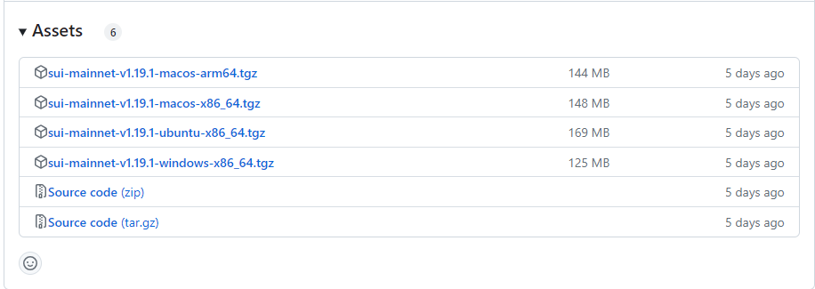
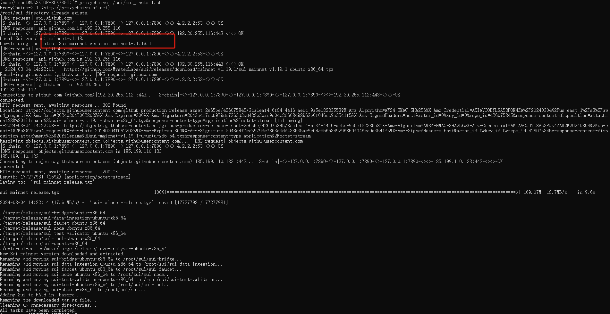
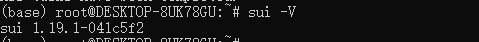

**Sui环境-二进制文件安装**

### **前言 **

由于个人使用的是windows子系统wsl安装的sui环境，所以本文适用于wsl系统或者ubuntu系统。

### **2.1 手动安装**

在官方Github仓库的Release中有编译好的二进制文件

https://github.com/MystenLabs/sui/releases

Release提供四种不同类型的操作系统的二进制文件  



这里选择ubuntu系统的压缩包，建议选择mainnet作为本地sui环境配置。

下载对应系统的压缩包后解压你能得到类似于下面结构：

```
+ target 
	+ release   
		- sui-faucet-ubuntu-x86_64   
		- sui-node-ubuntu-x86_64   
		- sui-test-validator-ubuntu-x86_64   
		- sui-tool-ubuntu-x86_64   
		- sui-ubuntu-x86_64
external-crates\move\target\release\move-analyzer-ubuntu-x86_64
```

文件名格式为 sui-`<操作系统>`-`<架构>`：

- sui-faucet-`<操作系统>`-`<架构>`：本地网络上用于铸币的工具。
- sui-indexer-`<操作系统>`-`<架构>`：本地Sui 网络的索引器。
- sui-`<操作系统>`-`<架构>`：Sui 的主要执行文件。
- sui-node-`<操作系统>`-`<架构>`：用于运行本地节点。
- sui-test-validator-`<操作系统>`-`<架构>`：用于开发的本地网络测试验证器。
- sui-tool-`<操作系统>`-`<架构>`：提供 Sui 相关的工具。

然后你需要做的就是将这些文件放在一起，移除掉 -`<操作系统>`-`<架构>` 部分，再将他们添加到系统的环境变量中。

```
+ target 
	+ release   
		- sui-faucet   
		- sui-node   
		- sui-test-validator   
		- sui-tool   
- suiexternal-crates\move\target\release\move-analyzer
```

假设，你已经处理了所有文件并将它们放在了当前目录的 sui 文件夹中，那么对应不同系统的操作如下：

```
echo 'export PATH="$PATH:'$(pwd)'/sui"' >> ~/.bashrc
source ~/.bashrc
```

完成上述操作后便能在命令行中使用 sui 命令。

### **2.2 脚本安装**

以下是自动化脚本更新,将脚本放至sui安装目录下执行即可，然后修改代码中的devnet、testnet、mainnet可以自己选择下载。

```bash
#!/bin/bash

TARGET_DIR=/root/sui

if [ ! -d "$TARGET_DIR" ]; then
	    echo "Creating $TARGET_DIR directory..."
	        mkdir "$TARGET_DIR"
	else
		    echo "$TARGET_DIR directory already exists."
fi

cd "$TARGET_DIR"

latest_version_tag=$(curl -s "https://api.github.com/repos/MystenLabs/sui/releases" | jq -r '.[] | select(.tag_name | test("mainnet")) | .tag_name' | head -n 1)


version_file="${TARGET_DIR}/sui_version.txt"

if [ -f "$version_file" ]; then
    local_version_tag=$(cat "$version_file")
    echo "Local Sui version: $local_version_tag"
else
    local_version_tag=""
    echo "Version file not found. Will download the latest version."
fi


if [ "$local_version_tag" != "$latest_version_tag" ] || [ -z "$local_version_tag" ]; then
    echo "Downloading the latest Sui mainnet version: $latest_version_tag"

	download_url=$(curl -s "https://api.github.com/repos/MystenLabs/sui/releases" | jq -r '.[] | select(.name | test("mainnet")) | .assets[] | select(.name | test("ubuntu-x86_64.tgz")) | .browser_download_url' | head -n 1)

    wget "$download_url" -O sui-mainnet-release.tgz
    tar -zxvf sui-mainnet-release.tgz

    echo "$latest_version_tag" > "$version_file"
    echo "New Sui mainnet version downloaded and extracted."

	for f in target/release/*-ubuntu-x86_64; do
		original_name=$(basename "$f")
		new_name="${original_name%-ubuntu-x86_64}"

			echo "Renaming and moving $original_name to $TARGET_DIR/$new_name..."
				mv -f "$f" "$TARGET_DIR/$new_name"
		done

		echo "Adding Sui to PATH in .bashrc..."
		echo 'export PATH="$PATH:'"$TARGET_DIR"'"' >> ~/.bashrc
		source ~/.bashrc

		echo "Removing the downloaded tar.gz file..."
		rm -f sui-mainnet-release.tgz

		echo "Cleaning up unnecessary directories..."
		rm -rf target external-crates

		echo "All tasks have been completed."
else
    echo "Current Sui mainnet version is up-to-date with the latest version: $local_version_tag"
fi
```

脚本实现新安装或者更新，下图是检测到本地的版本过低进行了更新



检查本地版本为更新后的版本




## Sui move_cn社交账号

- telegram: https://t.me/move_cn
- X(twitter): https://twitter.com/move_cn
- QQ群: 79489587
- 微信公众号: [](https://github.com/move-cn/MoveCreatorMakeSUI/blob/main/images/move_cn_wechat.png)
- Sui中文开发群: https://t.me/sui_dev_cn